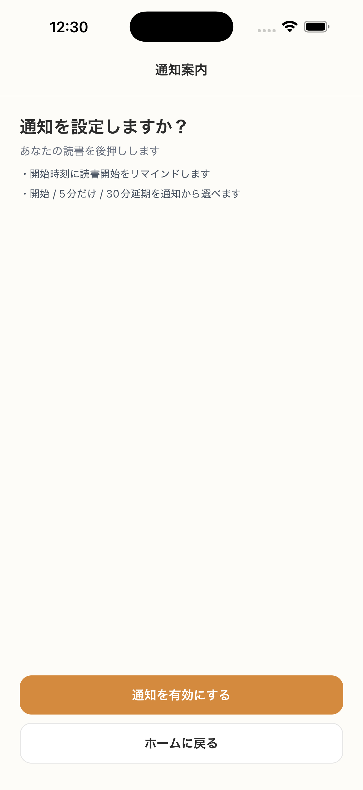

# SC-03 初回オンボーディング_通知案内

## ID
SC-03

## 種別
Screen

## ステータス
active

## 役割
通知権限を自然に案内する

## 表示条件
SC-02 完了後

## 主/副CTA
### 主CTA
通知をオンにする

### 副CTA
あとで

## 主要要素
* 通知の価値説明
* 権限要求ボタン

## 遷移
* 許可 / スキップ -> SC-04

## 異常時縮退
* 拒否されても利用継続可能

## 画面イメージ(実画面)


## 画像取得元
- captureId: SC-03:normal
- scenario: normal
- captureMode: detox_flow
- sourceRef: e2e/snapshots/onboarding-snapshots.e2e.js
- refresh: `cd /Users/haradatakashi/Developer/readingcoach/readingcoach/app && npm run e2e:capture:docs && npm run docs:screen-spec:refresh`

## 親台帳原文
```markdown
* 役割: 通知権限を自然に案内する
* 表示条件: SC-02 完了後
* 主 CTA: 通知をオンにする
* 副 CTA: あとで
* 主要表示要素:

  * 通知の価値説明
  * 権限要求ボタン
* 遷移:

  * 許可 / スキップ -> SC-04
* 異常時縮退:

  * 拒否されても利用継続可能
```
