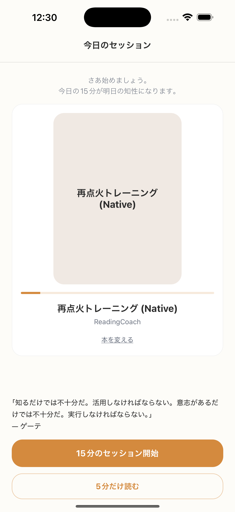

# SC-04 通常ホーム

## ID
SC-04

## 種別
Screen

## ステータス
active

## 役割
今日のセッションを提示し、最短で開始させる

## 表示条件
通常時

## 主/副CTA
### 主CTA
15分読む

### 副CTA
5分だけ読む

## 主要要素
* 今日のセッション
* 次の開始時刻
* 主 CTA
* Ghost Link（本変更）

## 遷移
* 15 分開始 -> SC-12
* 5 分開始 -> SC-24
* 本変更 -> SC-20
* ライブラリ -> SC-20

## 異常時縮退
* plan 欠損 -> 再生成して表示
* book 参照切れ -> SC-20 へ誘導

## 画面イメージ(実画面)


## 画像取得元
- captureId: SC-04:normal
- scenario: normal
- captureMode: detox_flow
- sourceRef: e2e/snapshots/home-snapshots.e2e.js
- refresh: `cd /Users/haradatakashi/Developer/readingcoach/readingcoach/app && npm run e2e:capture:docs && npm run docs:screen-spec:refresh`

## 親台帳原文
```markdown
* 役割: 今日のセッションを提示し、最短で開始させる
* 表示条件: 通常時
* 主 CTA: 15分読む
* 副 CTA: 5分だけ読む
* 主要表示要素:

  * 今日のセッション
  * 次の開始時刻
  * 主 CTA
  * Ghost Link（本変更）
* 遷移:

  * 15 分開始 -> SC-12
  * 5 分開始 -> SC-24
  * 本変更 -> SC-20
  * ライブラリ -> SC-20
* 異常時縮退:

  * plan 欠損 -> 再生成して表示
  * book 参照切れ -> SC-20 へ誘導
```
