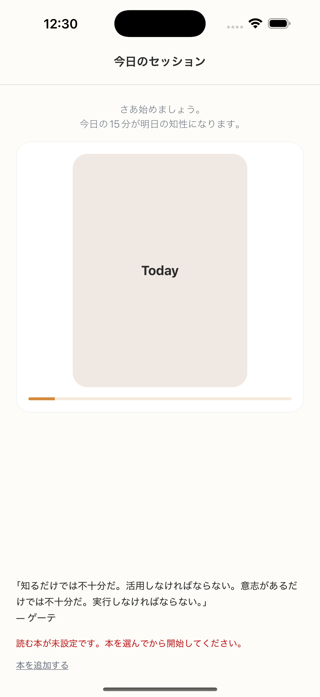

# SC-05 通常ホーム_今日は重い

## ID
SC-05

## 種別
Screen

## ステータス
active

## 役割
通常主導線を維持しつつ、心理負荷が高い日に軽量トーンで開始させる

## 表示条件
`heavy_day_signal = true`

## 主/副CTA
### 主CTA
15分読む

### 副CTA
5分だけ読む

## 主要要素
* SC-04 と同等
* 軽量トーンの補助文
* 通常時より強く認知される 5 分導線

## 遷移
* 15 分開始 -> SC-12
* 5 分開始 -> SC-24

## 異常時縮退
（該当なし / 親台帳原文参照）

## 画面イメージ(実画面)


## 画像取得元
- captureId: SC-05:heavy_day
- scenario: heavy_day
- captureMode: detox_injected
- sourceRef: e2e/snapshots/home-snapshots.e2e.js
- refresh: `cd /Users/haradatakashi/Developer/readingcoach/readingcoach/app && npm run e2e:capture:docs && npm run docs:screen-spec:refresh`

## 親台帳原文
```markdown
* 役割: 通常主導線を維持しつつ、心理負荷が高い日に軽量トーンで開始させる
* 表示条件: `heavy_day_signal = true`
* 主 CTA: 15分読む
* 副 CTA: 5分だけ読む
* 主要表示要素:

  * SC-04 と同等
  * 軽量トーンの補助文
  * 通常時より強く認知される 5 分導線
* 遷移:

  * 15 分開始 -> SC-12
  * 5 分開始 -> SC-24
```
