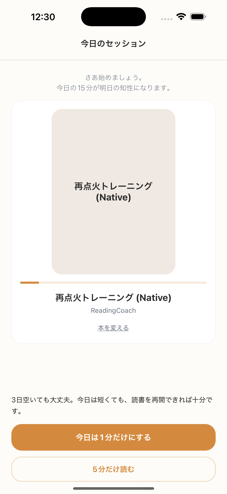

# SC-06 Rehab ホーム

## ID
SC-06

## 種別
Screen

## ステータス
active

## 役割
3 日以上未達時の再開導線

## 表示条件
`continuous_missed_days >= 3` かつ `< 7`

## 主/副CTA
### 主CTA
1分で再点火

### 副CTA
5分だけ読む

## 主要要素
* 今日のセッション
* 回復支援コピー
* 主 CTA
* Rehab バナー
* Ghost Link

## 遷移
* 1 分開始 -> SC-14
* 5 分開始 -> SC-24
* 3 分再開 -> SC-13
* 本変更 -> SC-20

## 異常時縮退
* Strategic Bypass 候補がなければ既存安全本を使う

## 画面イメージ(実画面)


## 画像取得元
- captureId: SC-06:rehab
- scenario: rehab
- captureMode: detox_injected
- sourceRef: e2e/snapshots/home-snapshots.e2e.js
- refresh: `cd /Users/haradatakashi/Developer/readingcoach/readingcoach/app && npm run e2e:capture:docs && npm run docs:screen-spec:refresh`

## 親台帳原文
```markdown
* 役割: 3 日以上未達時の再開導線
* 表示条件: `continuous_missed_days >= 3` かつ `< 7`
* 主 CTA: 1分で再点火
* 副 CTA: 5分だけ読む
* 補助要素: Rehab バナー（3分再開）
* 主要表示要素:

  * 今日のセッション
  * 回復支援コピー
  * 主 CTA
  * Rehab バナー
  * Ghost Link
* 遷移:

  * 1 分開始 -> SC-14
  * 5 分開始 -> SC-24
  * 3 分再開 -> SC-13
  * 本変更 -> SC-20
* 異常時縮退:

  * Strategic Bypass 候補がなければ既存安全本を使う
```
