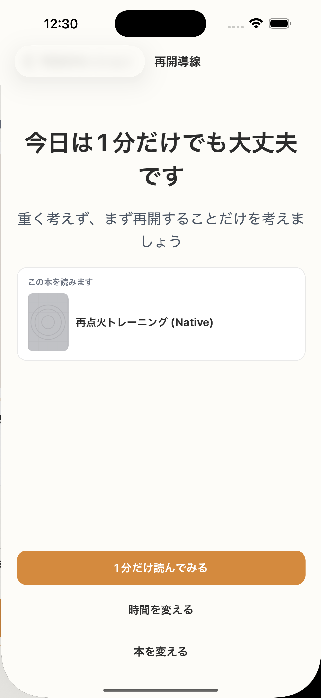

# SC-07 再開専用導線

## ID
SC-07

## 種別
Screen

## ステータス
active

## 役割
7 日以上未達からの再開

## 表示条件
`continuous_missed_days >= 7`

## 主/副CTA
### 主CTA
1分だけで再開する

### 副CTA
* library を開く
* 時間を変える
* 今日はやめる

## 主要要素
* 再開支援コピー
* 少数 CTA

## 遷移
* 1 分開始 -> SC-14
* library -> SC-20
* 総合設定 -> SC-22
* 閉じる -> 終了

## 異常時縮退
（該当なし / 親台帳原文参照）

## 画面イメージ(実画面)


## 画像取得元
- captureId: SC-07:long_absence
- scenario: long_absence
- captureMode: detox_injected
- sourceRef: e2e/snapshots/home-snapshots.e2e.js
- refresh: `cd /Users/haradatakashi/Developer/readingcoach/readingcoach/app && npm run e2e:capture:docs && npm run docs:screen-spec:refresh`

## 親台帳原文
```markdown
* 役割: 7 日以上未達からの再開
* 表示条件: `continuous_missed_days >= 7`
* 主 CTA: 1分だけで再開する
* 副 CTA:

  * library を開く
  * 時間を変える
  * 今日はやめる
* 主要表示要素:

  * 再開支援コピー
  * 少数 CTA
* 遷移:

  * 1 分開始 -> SC-14
  * library -> SC-20
  * 総合設定 -> SC-22
  * 閉じる -> 終了
```
