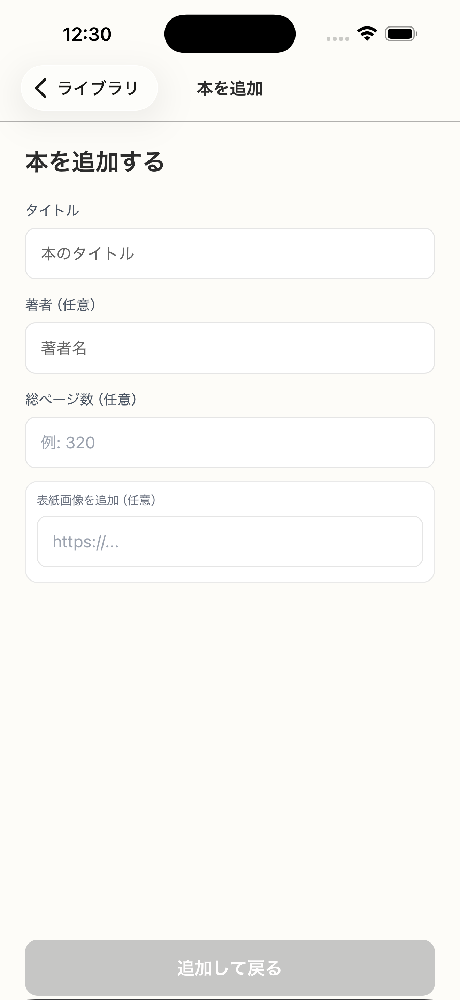

# SC-10 本を追加する

## ID
SC-10

## 種別
Screen

## ステータス
active

## 役割
最低限の情報で本を保存する

## 表示条件
検索 0 件 / オフライン / API 異常

## 主/副CTA
### 主CTA
保存する

### 副CTA
（親台帳原文参照）

## 主要要素
（親台帳原文参照）

## 遷移
* 保存成功 -> 呼び出し元へ戻る

## 異常時縮退
（該当なし / 親台帳原文参照）

## 画面イメージ(実画面)


## 画像取得元
- captureId: SC-10:timeout_or_error
- scenario: timeout_or_error
- captureMode: detox_injected
- sourceRef: e2e/snapshots/addbook-snapshots.e2e.js
- refresh: `cd /Users/haradatakashi/Developer/readingcoach/readingcoach/app && npm run e2e:capture:docs && npm run docs:screen-spec:refresh`

## 親台帳原文
```markdown
* 役割: 最低限の情報で本を保存する
* 表示条件: 検索 0 件 / オフライン / API 異常
* 主 CTA: 保存する
* 入力項目:

  * タイトル（必須）
  * 著者（任意）
  * 総ページ数（任意）
  * 表紙画像を追加（任意）
* 遷移:

  * 保存成功 -> 呼び出し元へ戻る
```
