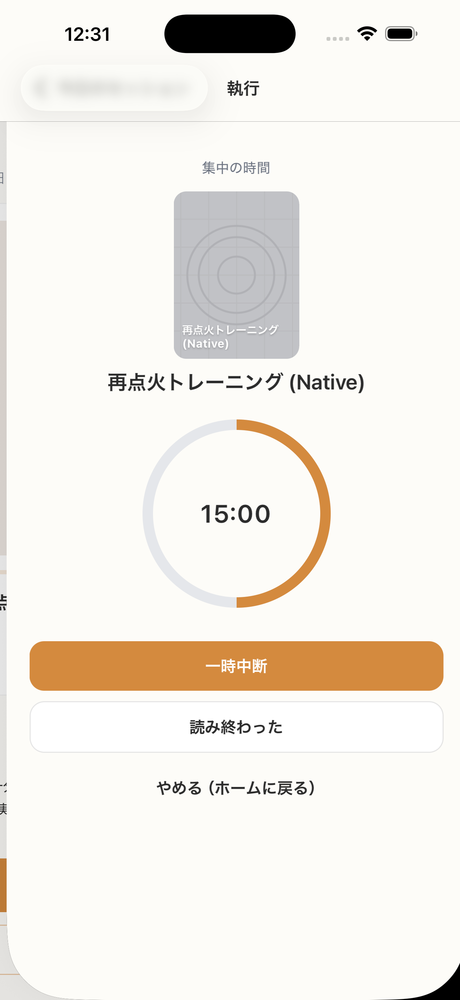

# SC-12 Active Session_15分

## ID
SC-12

## 種別
Screen

## ステータス
active

## 役割
通常セッション実行中

## 表示条件
15 分開始後

## 主/副CTA
### 主CTA
なし

### 副CTA
（親台帳原文参照）

## 主要要素
* 本タイトル
* 残り時間
* 進行状態

## 遷移
* 完了 -> SC-15

## 異常時縮退
* クラッシュ後は復旧
* Live Activity 失敗でも継続

## 画面イメージ(実画面)


## 画像取得元
- captureId: SC-12:normal
- scenario: normal
- captureMode: detox_flow
- sourceRef: e2e/snapshots/session-snapshots.e2e.js
- refresh: `cd /Users/haradatakashi/Developer/readingcoach/readingcoach/app && npm run e2e:capture:docs && npm run docs:screen-spec:refresh`

## 親台帳原文
```markdown
* 役割: 通常セッション実行中
* 表示条件: 15 分開始後
* 主 CTA: なし
* 主要表示要素:

  * 本タイトル
  * 残り時間
  * 進行状態
* 遷移:

  * 完了 -> SC-15
* 異常時縮退:

  * クラッシュ後は復旧
  * Live Activity 失敗でも継続
```
