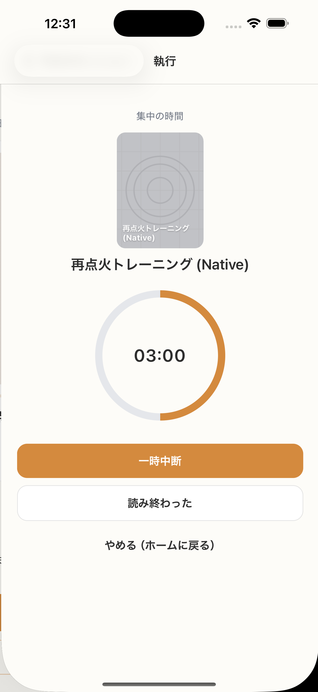

# SC-13 Active Session_3分

## ID
SC-13

## 種別
Screen

## ステータス
active

## 役割
3 分再開セッション実行中

## 表示条件
3 分開始後

## 主/副CTA
### 主CTA
なし

### 副CTA
（親台帳原文参照）

## 主要要素
SC-12 と同等

## 遷移
* 完了 -> SC-15

## 異常時縮退
（該当なし / 親台帳原文参照）

## 画面イメージ(実画面)


## 画像取得元
- captureId: SC-13:rehab
- scenario: rehab
- captureMode: detox_injected
- sourceRef: e2e/snapshots/session-snapshots.e2e.js
- refresh: `cd /Users/haradatakashi/Developer/readingcoach/readingcoach/app && npm run e2e:capture:docs && npm run docs:screen-spec:refresh`

## 親台帳原文
```markdown
* 役割: 3 分再開セッション実行中
* 表示条件: 3 分開始後
* 主 CTA: なし
* 主要表示要素: SC-12 と同等
* 遷移:

  * 完了 -> SC-15
```
