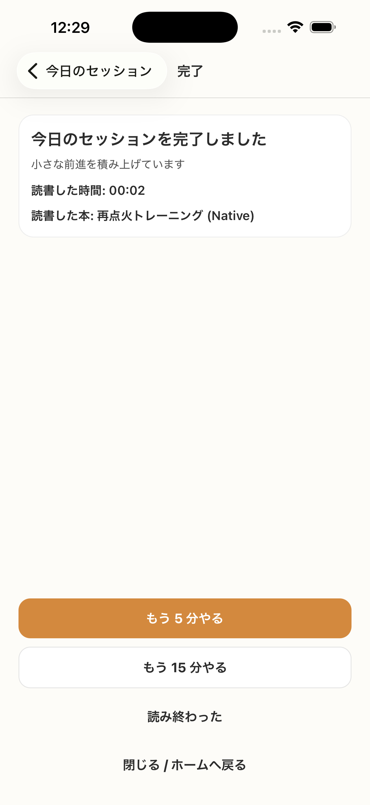

# SC-15 完了後サマリー_通常

## ID
SC-15

## 種別
Screen

## ステータス
active

## 役割
完了直後の前進感を返し、次の行動を選ばせる

## 表示条件
セッション完了後

## 主/副CTA
### 主CTA
* もう 5 分やる
* もう 15 分やる

### 副CTA
（親台帳原文参照）

## 主要要素
* 今日の達成メッセージ
* 実行時間
* 必要に応じ progress 表示

## 遷移
* `もう 5 分やる` -> SC-18 または SC-24
* `もう 15 分やる` -> SC-18 または SC-12
* `読了した` -> SC-19
* `閉じる / ホームへ戻る` -> SC-04 / SC-06 / SC-07
* 初回完了かつ progress tracking 未設定時のみ SC-16 への導線を表示

## 異常時縮退
（該当なし / 親台帳原文参照）

## 画面イメージ(実画面)


## 画像取得元
- captureId: SC-15:normal
- scenario: normal
- captureMode: detox_flow
- sourceRef: e2e/snapshots/completion-snapshots.e2e.js
- refresh: `cd /Users/haradatakashi/Developer/readingcoach/readingcoach/app && npm run e2e:capture:docs && npm run docs:screen-spec:refresh`

## 親台帳原文
```markdown
* 役割: 完了直後の前進感を返し、次の行動を選ばせる
* 表示条件: セッション完了後
* 主 CTA:

  * もう 5 分やる
  * もう 15 分やる
* 補助 CTA:

  * 読了した
  * 閉じる / ホームへ戻る
* 主要表示要素:

  * 今日の達成メッセージ
  * 実行時間
  * 必要に応じ progress 表示
* 備考:

  * `少し進んだ / かなり進んだ` の自己申告は廃止
  * 一般前進はシステムメッセージで返す
  * 金額換算や asset/value 系の表示は行わない
* 遷移:

  * `もう 5 分やる` -> SC-18 または SC-24
  * `もう 15 分やる` -> SC-18 または SC-12
  * `読了した` -> SC-19
  * `閉じる / ホームへ戻る` -> SC-04 / SC-06 / SC-07
  * 初回完了かつ progress tracking 未設定時のみ SC-16 への導線を表示
```
