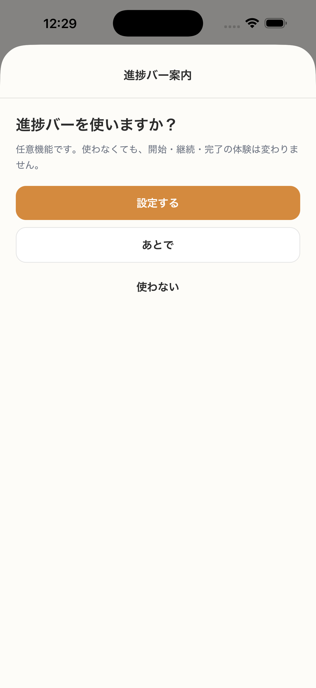

# SC-16 完了後_進捗バー案内

## ID
SC-16

## 種別
Screen

## ステータス
active

## 役割
初回完了後に progress tracking を opt-in で提案する

## 表示条件
初回セッション完了後のみ

## 主/副CTA
### 主CTA
設定する

### 副CTA
* あとで
* 使わない

## 主要要素
* 価値説明
* 非必須であることの明示

## 遷移
* 設定する -> SC-17
* あとで / 使わない -> SC-15 またはホームへ

## 異常時縮退
（該当なし / 親台帳原文参照）

## 画面イメージ(実画面)


## 画像取得元
- captureId: SC-16:normal
- scenario: normal
- captureMode: detox_flow
- sourceRef: e2e/snapshots/completion-snapshots.e2e.js
- refresh: `cd /Users/haradatakashi/Developer/readingcoach/readingcoach/app && npm run e2e:capture:docs && npm run docs:screen-spec:refresh`

## 親台帳原文
```markdown
* 役割: 初回完了後に progress tracking を opt-in で提案する
* 位置づけ: 追加仕様ではなく正式仕様
* 表示条件: 初回セッション完了後のみ
* 主 CTA: 設定する
* 副 CTA:

  * あとで
  * 使わない
* 主要表示要素:

  * 価値説明
  * 非必須であることの明示
* 遷移:

  * 設定する -> SC-17
  * あとで / 使わない -> SC-15 またはホームへ
```
