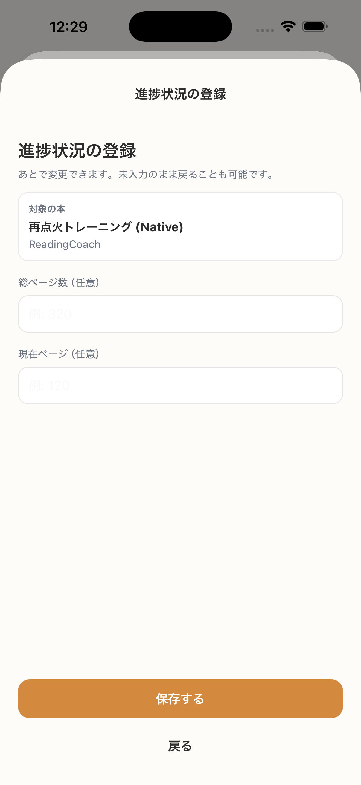

# SC-17 完了後_進捗詳細入力

## ID
SC-17

## 種別
Screen

## ステータス
active

## 役割
progress bar 利用者向け初期設定

## 表示条件
SC-16 で設定するを選んだとき

## 主/副CTA
### 主CTA
保存する

### 副CTA
（親台帳原文参照）

## 主要要素
（親台帳原文参照）

## 遷移
* 保存成功 -> SC-15 またはホームへ

## 異常時縮退
（該当なし / 親台帳原文参照）

## 画面イメージ(実画面)


## 画像取得元
- captureId: SC-17:normal
- scenario: normal
- captureMode: detox_flow
- sourceRef: e2e/snapshots/completion-snapshots.e2e.js
- refresh: `cd /Users/haradatakashi/Developer/readingcoach/readingcoach/app && npm run e2e:capture:docs && npm run docs:screen-spec:refresh`

## 親台帳原文
```markdown
* 役割: progress bar 利用者向け初期設定
* 位置づけ: 追加仕様ではなく正式仕様
* 表示条件: SC-16 で設定するを選んだとき
* 主 CTA: 保存する
* 入力項目:

  * 総ページ数（既知なら初期値）
  * 現在ページ
* 遷移:

  * 保存成功 -> SC-15 またはホームへ
* 備考:

  * progress bar は opt-in
  * 未設定でも主導線に影響しない
```
