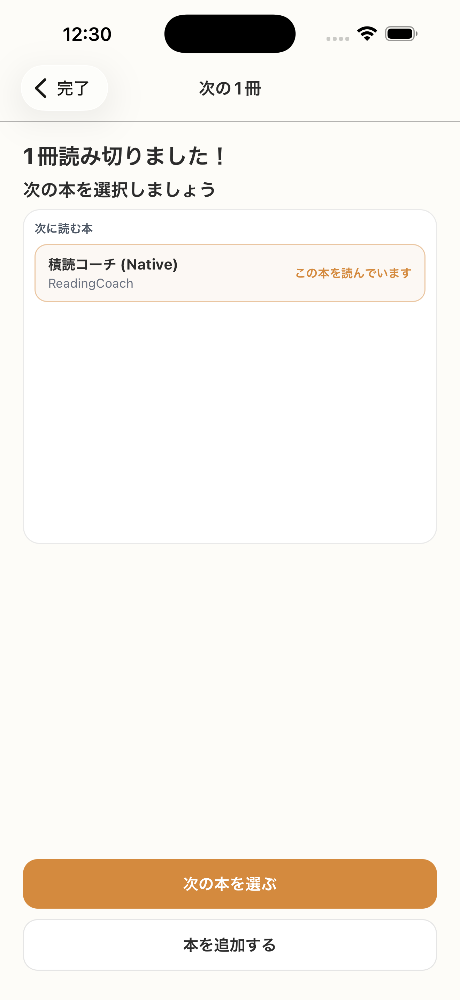

# SC-19 完了後_読了次本指名

## ID
SC-19

## 種別
Screen

## ステータス
active

## 役割
読了後に次の Focus Book を決める

## 表示条件
`finished_book`

## 主/副CTA
### 主CTA
次の本を選ぶ

### 副CTA
（親台帳原文参照）

## 主要要素
* 候補本一覧（選択中のみ「この本を読んでいます」を表示）
* library / queue 起点
* 固定サイズの選択エリア（冊数が増えても高さ固定、内部スクロール）

## 遷移
* 決定 -> ホームへ

## 異常時縮退
（該当なし / 親台帳原文参照）

## 画面イメージ(実画面)


## 画像取得元
- captureId: SC-19:finished_book
- scenario: finished_book
- captureMode: detox_flow
- sourceRef: e2e/snapshots/completion-snapshots.e2e.js
- refresh: `cd /Users/haradatakashi/Developer/readingcoach/readingcoach/app && npm run e2e:capture:docs && npm run docs:screen-spec:refresh`

## 親台帳原文
```markdown
* 役割: 読了後に次の Focus Book を決める
* 表示条件: `finished_book`
* 主 CTA: 次の本を選ぶ
* 主要表示要素:

  * 候補本一覧（選択中のみ「この本を読んでいます」を表示）
  * library / queue 起点
  * 固定サイズの選択エリア（冊数が増えても高さ固定、内部スクロール）
* 遷移:

  * 決定 -> ホームへ
```
