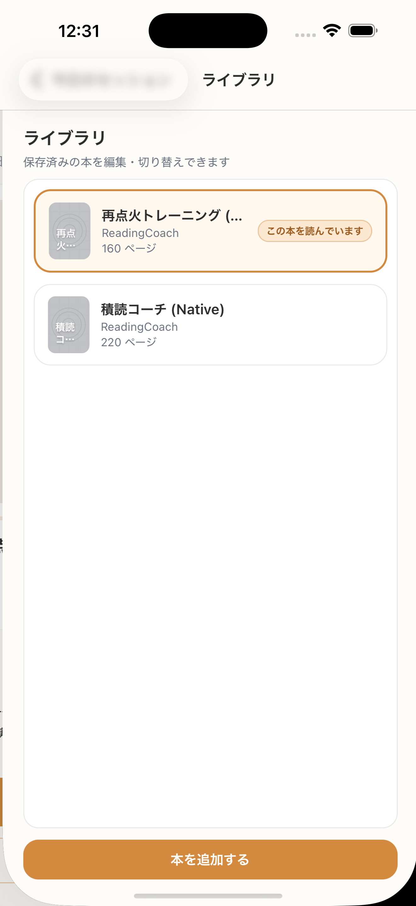

# SC-20 ライブラリ

## ID
SC-20

## 種別
Screen

## ステータス
active

## 役割
蔵書一覧と詳細起点

## 表示条件
明示的遷移時

## 主/副CTA
### 主CTA
本を選ぶ

### 副CTA
（親台帳原文参照）

## 主要要素
* 固定サイズの蔵書選択エリア（20冊でも高さ固定、内部スクロール）
* progress bar（利用者のみ）
* 書影または placeholder

## 遷移
* 本詳細 -> SC-21
* 本追加 -> SC-09

## 異常時縮退
（該当なし / 親台帳原文参照）

## 画面イメージ(実画面)


## 画像取得元
- captureId: SC-20:normal
- scenario: normal
- captureMode: detox_flow
- sourceRef: e2e/snapshots/library-snapshots.e2e.js
- refresh: `cd /Users/haradatakashi/Developer/readingcoach/readingcoach/app && npm run e2e:capture:docs && npm run docs:screen-spec:refresh`

## 親台帳原文
```markdown
* 役割: 蔵書一覧と詳細起点
* 表示条件: 明示的遷移時
* 主 CTA: 本を選ぶ
* 補助 CTA: 本を追加する
* 主要表示要素:

  * 固定サイズの蔵書選択エリア（20冊でも高さ固定、内部スクロール）
  * progress bar（利用者のみ）
  * 書影または placeholder
* 遷移:

  * 本詳細 -> SC-21
  * 本追加 -> SC-09
```
