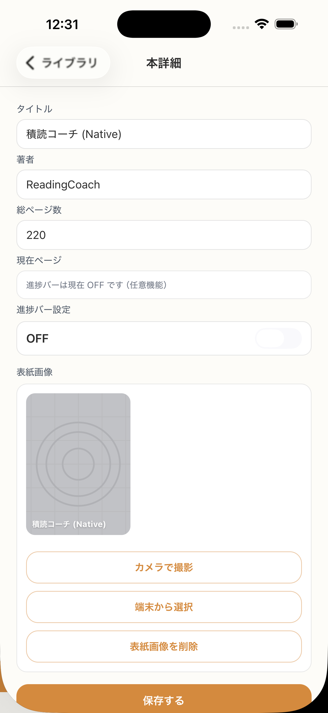

# SC-21 本詳細

## ID
SC-21

## 種別
Screen

## ステータス
active

## 役割
保存後編集の主戦場

## 表示条件
ライブラリから選択時

## 主/副CTA
### 主CTA
（親台帳原文参照）

### 副CTA
（親台帳原文参照）

## 主要要素
* 書誌情報
* progress bar
* 現在ページ
* 表紙画像

## 遷移
* Focus Book 設定 -> ホームへ
* 進捗更新 -> 同画面反映
* 書誌更新 -> 同画面反映

## 異常時縮退
（該当なし / 親台帳原文参照）

## 画面イメージ(実画面)


## 画像取得元
- captureId: SC-21:normal
- scenario: normal
- captureMode: detox_flow
- sourceRef: e2e/snapshots/library-snapshots.e2e.js
- refresh: `cd /Users/haradatakashi/Developer/readingcoach/readingcoach/app && npm run e2e:capture:docs && npm run docs:screen-spec:refresh`

## 親台帳原文
```markdown
* 役割: 保存後編集の主戦場
* 表示条件: ライブラリから選択時
* 主 CTA / 主操作:

  * Focus Book にする
  * 進捗を設定する
  * 表紙を差し替える
  * タイトルを修正する
  * 著者を修正する
  * ページ数を修正する
* 主要表示要素:

  * 書誌情報
  * progress bar
  * 現在ページ
  * 表紙画像
* 遷移:

  * Focus Book 設定 -> ホームへ
  * 進捗更新 -> 同画面反映
  * 書誌更新 -> 同画面反映
```
