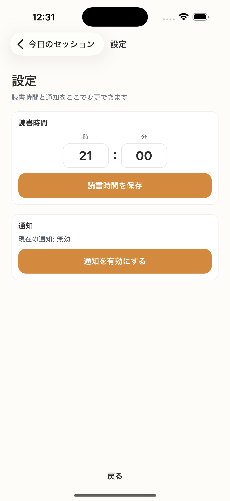

# SC-22 総合設定

## ID
SC-22

## 種別
Screen

## ステータス
active

## 役割
読書時間と通知設定をまとめて変更する

## 表示条件
再開専用導線または設定導線

## 主/副CTA
### 主CTA
* 読書時間を保存
* 通知を有効にする / 無効にする

### 副CTA
（親台帳原文参照）

## 主要要素
（親台帳原文参照）

## 遷移
* 保存成功 -> 呼び出し元へ戻る

## 異常時縮退
（該当なし / 親台帳原文参照）

## 画面イメージ(実画面)


## 画像取得元
- captureId: SC-22:normal
- scenario: normal
- captureMode: detox_flow
- sourceRef: e2e/snapshots/settings-snapshots.e2e.js
- refresh: `cd /Users/haradatakashi/Developer/readingcoach/readingcoach/app && npm run e2e:capture:docs && npm run docs:screen-spec:refresh`

## 親台帳原文
```markdown
* 役割: 読書時間と通知設定をまとめて変更する
* 表示条件: 再開専用導線または設定導線
* 主 CTA:

  * 読書時間を保存
  * 通知を有効にする / 無効にする
* 遷移:

  * 保存成功 -> 呼び出し元へ戻る
```
