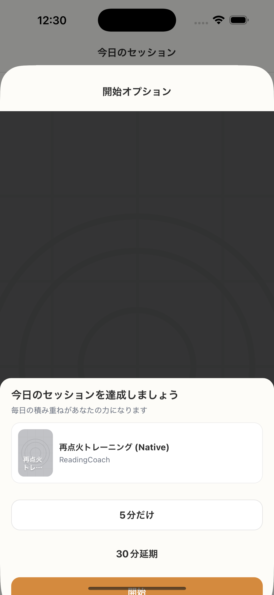

# SC-23 Due Action Sheet

## ID
SC-23

## 種別
Screen

## ステータス
active

## 役割
due 時点で最短開始を承諾させる

## 表示条件
通知 body tap / due 状態で app 復帰時

## 主/副CTA
### 主CTA
* 開始
* 5分だけ
* 30分延期

### 副CTA
（親台帳原文参照）

## 主要要素
（親台帳原文参照）

## 遷移
* 開始 -> 状態依存の第一導線（SC-12 または SC-14）
* 5分だけ -> SC-24
* 30分延期 -> plan 更新

## 異常時縮退
（該当なし / 親台帳原文参照）

## 画面イメージ(実画面)


## 画像取得元
- captureId: SC-23:due
- scenario: due
- captureMode: detox_injected
- sourceRef: e2e/snapshots/home-snapshots.e2e.js
- refresh: `cd /Users/haradatakashi/Developer/readingcoach/readingcoach/app && npm run e2e:capture:docs && npm run docs:screen-spec:refresh`

## 親台帳原文
```markdown
* 役割: due 時点で最短開始を承諾させる
* 表示条件: 通知 body tap / due 状態で app 復帰時
* 主 CTA:

  * 開始
  * 5分だけ
  * 30分延期
* 禁止:

  * 本変更
  * library 遷移
  * 管理操作
* 遷移:

  * 開始 -> 状態依存の第一導線（SC-12 または SC-14）
  * 5分だけ -> SC-24
  * 30分延期 -> plan 更新
```
