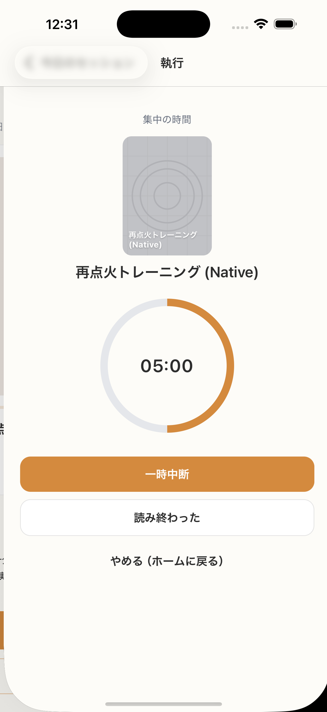

# SC-24 Active Session_5分

## ID
SC-24

## 種別
Screen

## ステータス
active

## 役割
5 分セッション実行中

## 表示条件
5 分開始後

## 主/副CTA
### 主CTA
* 一時中断（押下後は再開に切替）
* 読み終わった
* やめる（ホームに戻る）

### 副CTA
（親台帳原文参照）

## 主要要素
SC-12 と同等 + 中断状態表示

## 遷移
* 完了 -> SC-15
* 読み終わった -> SC-19
---

## 異常時縮退
（該当なし / 親台帳原文参照）

## 画面イメージ(実画面)


## 画像取得元
- captureId: SC-24:normal
- scenario: normal
- captureMode: detox_flow
- sourceRef: e2e/snapshots/session-snapshots.e2e.js
- refresh: `cd /Users/haradatakashi/Developer/readingcoach/readingcoach/app && npm run e2e:capture:docs && npm run docs:screen-spec:refresh`

## 親台帳原文
```markdown
* 役割: 5 分セッション実行中
* 表示条件: 5 分開始後
* 主 CTA:

  * 一時中断（押下後は再開に切替）
  * 読み終わった
  * やめる（ホームに戻る）
* 主要表示要素: SC-12 と同等 + 中断状態表示
* 遷移:

  * 完了 -> SC-15
  * 読み終わった -> SC-19

---
```
