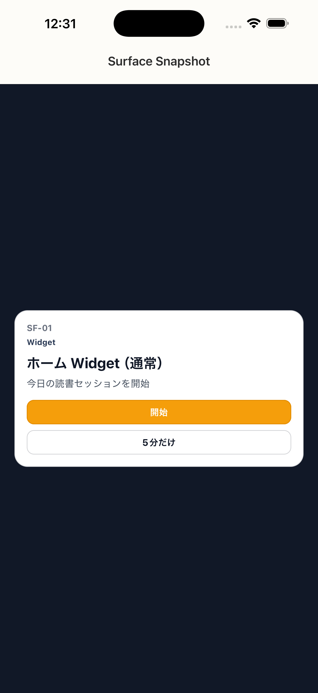

# SF-01 ホーム Widget_通常

## ID
SF-01

## 種別
Surface

## ステータス
active

## 役割
アプリを開かず、今日のセッションと開始を提示する

## 表示条件
（親台帳原文参照）

## 主/副CTA
### 主CTA
（親台帳原文参照）

### 副CTA
（親台帳原文参照）

## 主要要素
（親台帳原文参照）

## 遷移
* 開始 -> reconcile -> 状態依存の第一導線（通常: SC-12）
* 5分だけ -> reconcile -> SC-24

## 異常時縮退
* stale snapshot -> app 起動 + reconcile
* 書影欠損 -> placeholder

## 画面イメージ(実画面)


## 画像取得元
- captureId: SF-01:normal
- scenario: normal
- captureMode: xctest_simctl
- sourceRef: ios/appUITests/SurfaceSnapshotUITests.swift
- refresh: `cd /Users/haradatakashi/Developer/readingcoach/readingcoach/app && npm run e2e:capture:docs && npm run docs:screen-spec:refresh`

## 親台帳原文
```markdown
* 役割: アプリを開かず、今日のセッションと開始を提示する
* CTA: 開始 / 5分だけ
* 表示要素:

  * 今日のセッション
  * 開始時刻
  * 主 CTA
* 遷移:

  * 開始 -> reconcile -> 状態依存の第一導線（通常: SC-12）
  * 5分だけ -> reconcile -> SC-24
* 異常時縮退:

  * stale snapshot -> app 起動 + reconcile
  * 書影欠損 -> placeholder
```
