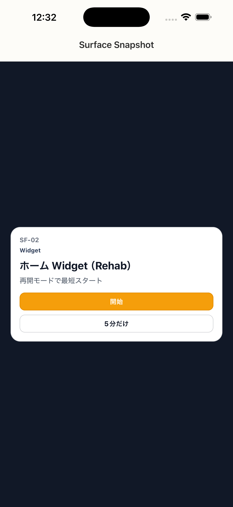

# SF-02 ホーム Widget_Rehab

## ID
SF-02

## 種別
Surface

## ステータス
active

## 役割
3 日以上未達時の軽量復帰

## 表示条件
（親台帳原文参照）

## 主/副CTA
### 主CTA
（親台帳原文参照）

### 副CTA
（親台帳原文参照）

## 主要要素
（親台帳原文参照）

## 遷移
* 開始 -> reconcile -> SC-14
* 5分だけ -> reconcile -> SC-24

## 異常時縮退
（該当なし / 親台帳原文参照）

## 画面イメージ(実画面)


## 画像取得元
- captureId: SF-02:rehab
- scenario: rehab
- captureMode: xctest_simctl
- sourceRef: ios/appUITests/SurfaceSnapshotUITests.swift
- refresh: `cd /Users/haradatakashi/Developer/readingcoach/readingcoach/app && npm run e2e:capture:docs && npm run docs:screen-spec:refresh`

## 親台帳原文
```markdown
* 役割: 3 日以上未達時の軽量復帰
* CTA: 開始 / 5分だけ
* 遷移:

  * 開始 -> reconcile -> SC-14
  * 5分だけ -> reconcile -> SC-24
```
