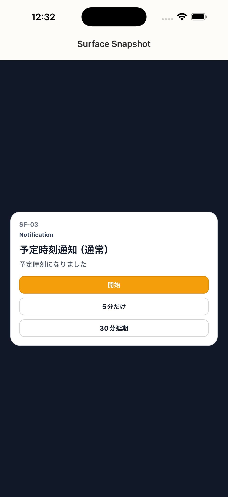

# SF-03 予定時刻通知_通常

## ID
SF-03

## 種別
Surface

## ステータス
active

## 役割
予定時刻で開始させる

## 表示条件
（親台帳原文参照）

## 主/副CTA
### 主CTA
（親台帳原文参照）

### 副CTA
（親台帳原文参照）

## 主要要素
（親台帳原文参照）

## 遷移
* 開始 -> reconcile -> SC-12
* 5 分 -> reconcile -> SC-24
* 延期 -> plan 更新

## 異常時縮退
（該当なし / 親台帳原文参照）

## 画面イメージ(実画面)


## 画像取得元
- captureId: SF-03:normal
- scenario: normal
- captureMode: xctest_simctl
- sourceRef: ios/appUITests/SurfaceSnapshotUITests.swift
- refresh: `cd /Users/haradatakashi/Developer/readingcoach/readingcoach/app && npm run e2e:capture:docs && npm run docs:screen-spec:refresh`

## 親台帳原文
```markdown
* 役割: 予定時刻で開始させる
* CTA:

  * 開始
  * 5分だけ
  * 30分延期
* 遷移:

  * 開始 -> reconcile -> SC-12
  * 5 分 -> reconcile -> SC-24
  * 延期 -> plan 更新
```
