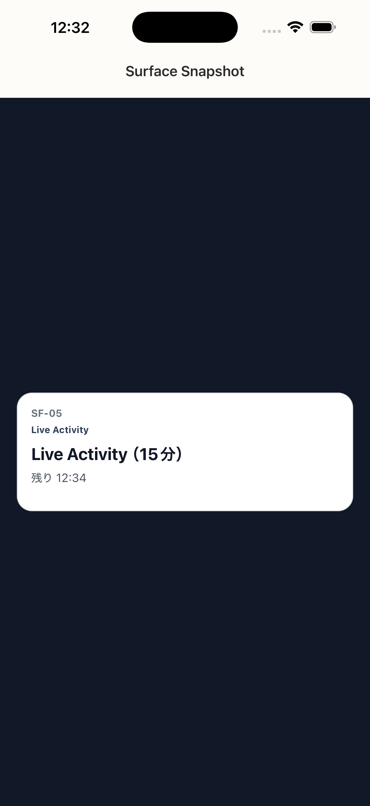

# SF-05 Live Activity_15分

## ID
SF-05

## 種別
Surface

## ステータス
active

## 役割
セッション中の進行表示

## 表示条件
（親台帳原文参照）

## 主/副CTA
### 主CTA
（親台帳原文参照）

### 副CTA
（親台帳原文参照）

## 主要要素
（親台帳原文参照）

## 遷移
（親台帳原文参照）

## 異常時縮退
（該当なし / 親台帳原文参照）

## 画面イメージ(実画面)


## 画像取得元
- captureId: SF-05:normal
- scenario: normal
- captureMode: xctest_simctl
- sourceRef: ios/appUITests/SurfaceSnapshotUITests.swift
- refresh: `cd /Users/haradatakashi/Developer/readingcoach/readingcoach/app && npm run e2e:capture:docs && npm run docs:screen-spec:refresh`

## 親台帳原文
```markdown
* 役割: セッション中の進行表示
* CTA: なし
* 表示要素:

  * 本タイトル
  * 残り時間
* 備考:

  * 表示専用
  * 状態管理の正本ではない
```
