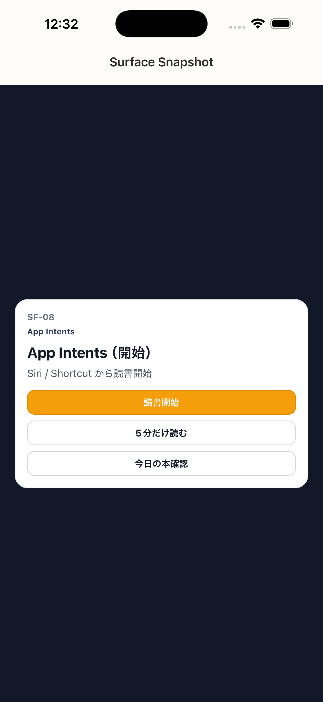

# SF-08 App Intents_開始

## ID
SF-08

## 種別
Surface

## ステータス
active

## 役割
Siri / Shortcut からの最短開始

## 表示条件
（親台帳原文参照）

## 主/副CTA
### 主CTA
（親台帳原文参照）

### 副CTA
（親台帳原文参照）

## 主要要素
（親台帳原文参照）

## 遷移
* 読書開始 -> reconcile -> 状態依存の第一導線
* 5分だけ読む -> reconcile -> SC-24
---

## 異常時縮退
（該当なし / 親台帳原文参照）

## 画面イメージ(実画面)


## 画像取得元
- captureId: SF-08:normal
- scenario: normal
- captureMode: xctest_simctl
- sourceRef: ios/appUITests/SurfaceSnapshotUITests.swift
- refresh: `cd /Users/haradatakashi/Developer/readingcoach/readingcoach/app && npm run e2e:capture:docs && npm run docs:screen-spec:refresh`

## 親台帳原文
```markdown
* 役割: Siri / Shortcut からの最短開始
* CTA:

  * 読書開始
  * 5分だけ読む
  * 今日の本確認
* 遷移:

  * 読書開始 -> reconcile -> 状態依存の第一導線
  * 5分だけ読む -> reconcile -> SC-24

---
```
